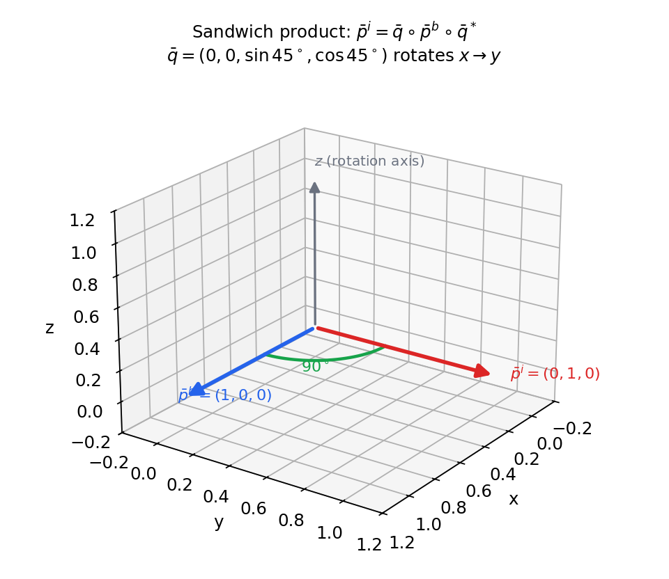
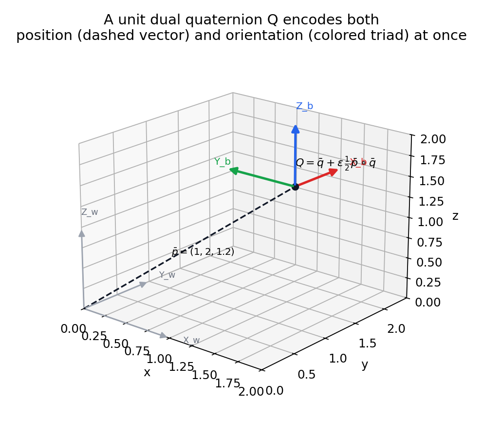
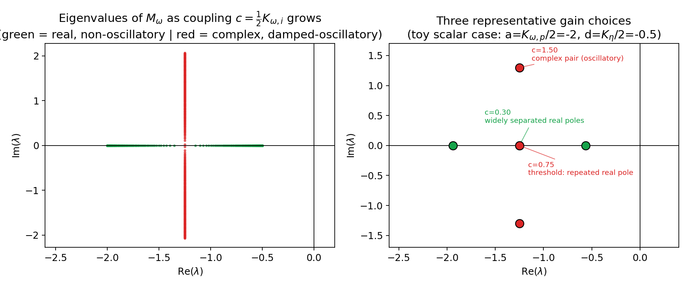
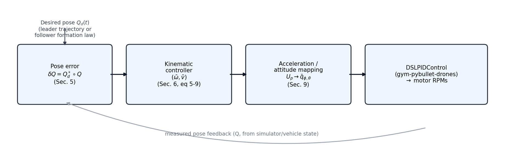
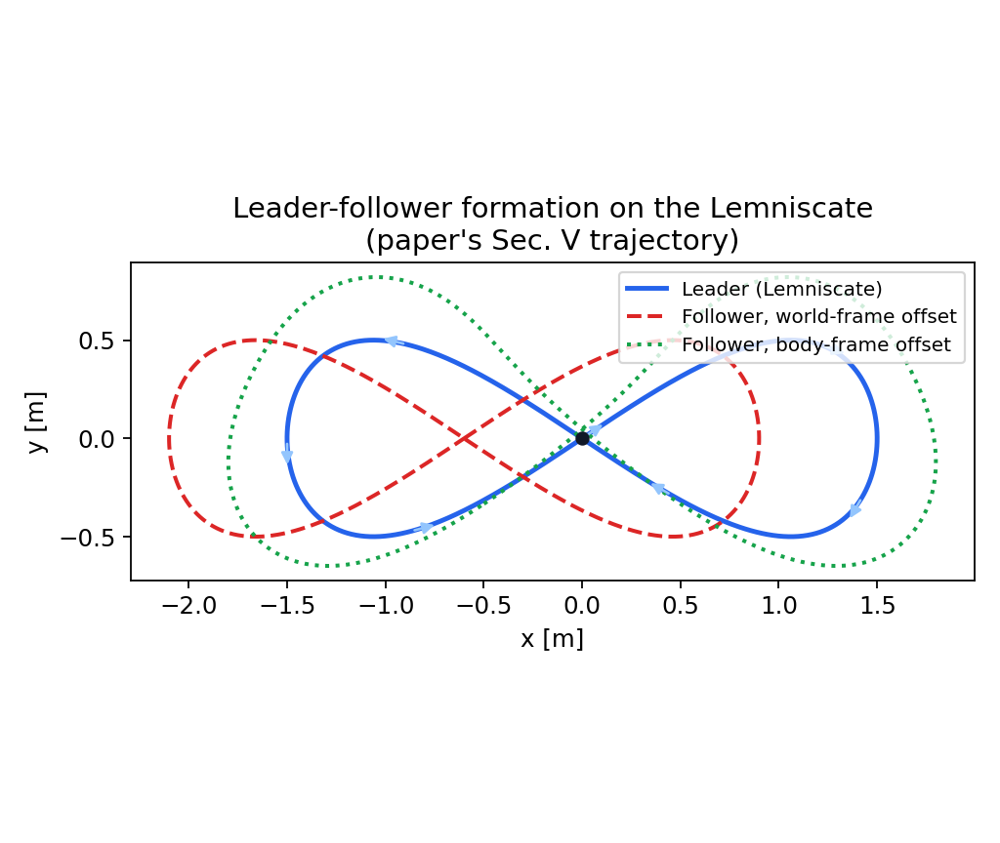
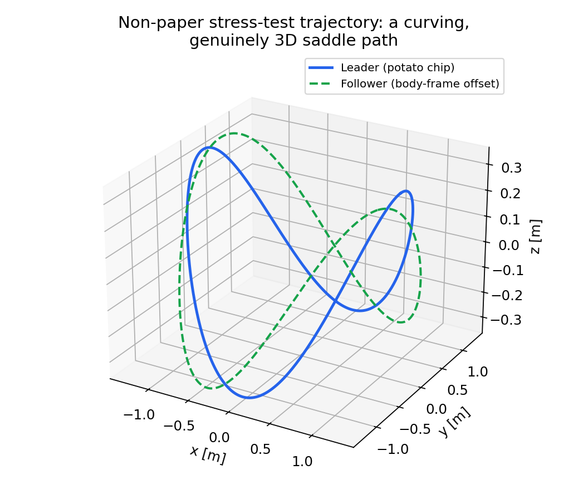

<p align="center">
  
</p>

# AB6: Introduction to Drones — Leader-Follower Formation of Two Quadrotors

A simulation of **dual quaternion-based control for a leader-follower formation of two quadrotors**, built to reproduce and explore the ideas from:

> H. N. Marciano, D. K. D. Villa, M. Sarcinelli-Filho, J. I. Giribet, *"Dual Quaternion-Based Control for a Leader-Follower Formation of Two Quadrotors,"* 2024 International Conference on Unmanned Aircraft Systems (ICUAS), Chania, Crete, Greece, June 4–7, 2024.

This document is written so that someone with **no prior background** in quaternions, dual numbers, or formation control can follow the math and the control design step by step, and then map each concept directly onto the code in this repository.

This expanded edition additionally works every core equation through **fully numeric, hand-checkable examples** (verified with a small NumPy script) and includes **diagrams and plots** generated directly from the same formulas, so you can see — not just read — what each piece of math does.

---

## Table of Contents

1. [Project Overview](#1-project-overview)
2. [Why Dual Quaternions?](#2-why-dual-quaternions)
3. [Mathematical Building Blocks](#3-mathematical-building-blocks)
   - 3.1 [Quaternions](#31-quaternions)
   - 3.2 [Quaternions as Rotations](#32-quaternions-as-rotations)
   - 3.3 [Dual Numbers](#33-dual-numbers)
   - 3.4 [Dual Quaternions](#34-dual-quaternions)
   - 3.5 [Dual Quaternions as Rigid-Body Pose](#35-dual-quaternions-as-rigid-body-pose)
4. [Vehicle Kinematics in Dual Quaternions](#4-vehicle-kinematics-in-dual-quaternions)
5. [Pose Error and the Control Objective](#5-pose-error-and-the-control-objective)
6. [The Kinematic Control Law](#6-the-kinematic-control-law)
7. [Why Tuning Is Hard: The Linearized Error Dynamics](#7-why-tuning-is-hard-the-linearized-error-dynamics)
8. [The Pole-Placement / Gain-Selection Method](#8-the-pole-placement--gain-selection-method)
9. [From Kinematics to Quadrotor Commands](#9-from-kinematics-to-quadrotor-commands)
10. [Leader-Follower Formation Law](#10-leader-follower-formation-law)
11. [Updated Multi-Simulator Architecture](#11-updated-multi-simulator-architecture)
12. [Repository Structure](#12-repository-structure)
13. [Folder-by-Folder Walkthrough](#13-folder-by-folder-walkthrough)
14. [Installation & Setup](#14-installation--setup)
15. [How to Run an Experiment](#15-how-to-run-an-experiment)
16. [Simulator Backends](#16-simulator-backends)
17. [Visualizing Results and Metrics](#17-visualizing-results-and-metrics)
18. [Running the Tests](#18-running-the-tests)
19. [Design Notes: Controller-to-Simulator Cascade](#19-design-notes-controller-to-simulator-cascade)
20. [Quick Reference](#20-quick-reference)
21. [Appendix A: Full End-to-End Numeric Walkthrough](#21-appendix-a-full-end-to-end-numeric-walkthrough)
22. [Appendix B: Notation Glossary](#22-appendix-b-notation-glossary)

---

## 1. Project Overview

Coordinating multiple drones is a core problem in robotics: think of a "leader" drone flying a planned path while one or more "follower" drones automatically maintain a fixed relative position and orientation with respect to it. This is the **leader-follower formation control** paradigm.

The reference paper tackles this problem for **two small quadrotors** using **dual quaternions** — a single mathematical object that represents *both* the orientation *and* the position of a rigid body at once. The paper's main contributions are:

- A **kinematic control law**, expressed purely in dual quaternions, that drives a vehicle's pose (position + attitude) to a desired, possibly time-varying, pose.
- A **systematic method for choosing controller gains** (instead of trial and error), based on analyzing the eigenvalues of the *linearized* closed-loop error dynamics.
- **Experimental validation** on two real Parrot Bebop 2 quadrotors flying a leader-follower Lemniscate ("figure-eight") trajectory, under three different gain-tuning strategies.

This project reproduces that pipeline in simulation: modeling the drones, implementing the dual-quaternion kinematic controller, tuning gains using the paper's pole-placement approach, and comparing tracking performance across the same three experimental conditions the paper uses.

---

## 2. Why Dual Quaternions?

Classical approaches represent a rigid body's **attitude** (orientation) with rotation matrices or quaternions, and its **position** separately as a 3D vector. This works, but it means:

- Position and orientation are updated and controlled with *different* mathematical tools.
- Combining/composing successive rigid-body transformations (rotate, then translate, then rotate again, etc.) requires juggling matrices and vectors together, which is computationally heavier and easier to get subtly wrong.

**Dual quaternions solve this by unifying position and orientation into a single 8-dimensional algebraic object.** Just as a unit quaternion compactly encodes a 3D rotation, a *unit dual quaternion* compactly encodes a full **rigid-body pose** (rotation **and** translation) — and, crucially, poses can be *composed* with a single quaternion-like product, exactly the way rotations compose for ordinary quaternions. This gives:

- A unified, singularity-free representation of pose (no gimbal lock, unlike Euler angles).
- Computationally efficient composition and inversion of transformations.
- A natural way to define a single **pose error** between "where the drone is" and "where it should be," combining position and attitude error into one quantity.

This is why the paper — and this project — builds the entire leader-follower controller on top of dual quaternion algebra.

> **Worked comparison — why "one object" actually matters in practice**
>
> Suppose you need to compose three successive rigid-body transforms (e.g., "world → leader body → camera mount → gimbal"). With the classical representation you carry a rotation matrix `R ∈ SO(3)` **and** a translation vector `t ∈ ℝ³` for each transform, and composing two transforms `(R₁,t₁)` then `(R₂,t₂)` requires the (easy to get wrong) rule:
>
> $$ (R_2, t_2) \circ (R_1, t_1) = (R_2 R_1, R_2 t_1 + t_2) $$
>
> — a matrix-vector rule that is *different* from ordinary matrix multiplication. With unit dual quaternions, composing `Q₂` after `Q₁` is **exactly one dual-quaternion product**, `Q₂ ∘ Q₁`, using the *same* multiplication rule you'd use to compose pure rotations. There is nothing special to remember, and inverting a transform is just the conjugate, `Q⁻¹ = Q*`, instead of `(R,t)⁻¹ = (Rᵀ, -Rᵀt)`. This is exactly what `DualQuaternion.__mul__` and `.inverse()` (or equivalent) implement in `dq_control/dual_quaternion.py`.
>
> | | Rotation matrix + vector | Unit dual quaternion |
> |---|---|---|
> | Storage | 9 + 3 = 12 numbers (with 6 constraints) | 8 numbers (with 2 constraints: `‖q̄‖=1` and the dual-part orthogonality condition) |
> | Compose two poses | `(R₂R₁, R₂t₁+t₂)` — two different operations | `Q₂ ∘ Q₁` — one product |
> | Invert a pose | `(Rᵀ, -Rᵀt)` | `Q*` |
> | Interpolate poses | Needs separate schemes for rotation (e.g. SLERP) and translation (linear) | Screw Linear Interpolation (ScLERP) handles both together |
> | Singularities | None for matrices; Euler angles have gimbal lock | None (like plain quaternions) |

---

## 3. Mathematical Building Blocks

To understand dual quaternions, we build up from ordinary quaternions and dual numbers.

### 3.1 Quaternions

Quaternions extend complex numbers to four dimensions. A quaternion is written as:

$$\bar q = q + q_0, \qquad q \in \mathbb{R}^3,\ q_0 \in \mathbb{R}$$

or, in the classical notation:

$$\bar q = q_0 + i q_1 + j q_2 + k q_3$$

where `i, j, k` are imaginary units satisfying `i² = j² = k² = ijk = -1`. Equivalently, a quaternion can be split into:

- a **vector part** `q ∈ ℝ³` (analogous to the "imaginary" components), and
- a **scalar part** `q₀ ∈ ℝ` (the "real" component).

Quaternion multiplication is **not commutative** (`p ∘ q ≠ q ∘ p` in general) — order matters, just like it does for 3D rotations. Given `p = (p, p₀)` and `q = (q, q₀)`, the quaternion product can be written compactly in matrix form as:


$$
p \circ q =
\begin{bmatrix}
S(p) + p_0 I & p \\
-p^{\mathsf{T}} & p_0
\end{bmatrix}
\begin{bmatrix}
q \\
q_0
\end{bmatrix}
$$

where `S(·)` is the **skew-symmetric matrix** built from a vector such that `S(v) w = v × w` — i.e., matrix multiplication by `S(v)` reproduces the cross product with `v`.

Other key operations:
- **Conjugate:** `q* = (-q, q₀)` (flip the sign of the vector part).
- **Norm:** `‖q‖² = q ∘ q* = q* ∘ q` (a scalar).
- A vector `p ∈ ℝ³` can always be embedded as a *pure* quaternion `p̄ = (p, 0)` (zero scalar part).

> **Worked example — multiplying two quaternions by hand**
>
> Let `p̄ = (p, p₀)` with vector part `p = (0,0,0.7071)` and scalar part `p₀ = 0.7071` (this happens to be the quaternion for a 90° rotation about `z` — more on that in §3.2). Using the closed-form Hamilton product
>
> $$p \circ q = \big(p_0 q + q_0 p + p \times q, p_0 q_0 - p\cdot q\big)$$
>
> compute `p̄ ∘ p̄` (composing the rotation with itself):
>
> - vector part: `p₀·p + p₀·p + p×p = 0.7071·(0,0,0.7071) + 0.7071·(0,0,0.7071) + 0 = (0, 0, 1.0)` (the cross product of any vector with itself is zero)
> - scalar part: `p₀·p₀ − p·p = 0.7071² − 0.7071² = 0`
>
> So `p̄ ∘ p̄ = (0,0,1.0), 0)`. Running this through NumPy confirms it exactly:
>
> ```text
> >>> q_z90 ∘ q_z90 = (array([0., 0., 1.]), 0.0)
> >>> expected q_z180 = (array([0., 0., 1.]), 0.0)   # matches!
> ```
>
> This double-check is exactly what you'd hope: composing a 90° rotation about `z` with itself gives the 180° rotation about `z` (vector part `(0,0,1)` is `sin(90°)=1`, scalar part `cos(90°)=0`) — confirming that quaternion multiplication really does compose rotations by *adding* their angles when the axis is shared, just like multiplying two unit complex numbers `e^{iθ₁}e^{iθ₂}=e^{i(θ_1+θ_2)}` adds angles in 2D.

### 3.2 Quaternions as Rotations

A **unit-norm quaternion** (`‖q‖ = 1`) represents a rotation in 3D space, analogous to how a unit complex number represents a rotation in 2D. If `q̄` is the unit quaternion rotating from body frame `b` to inertial frame `i`, a vector expressed in the body frame transforms to the inertial frame via the **sandwich product**:

$$\bar p^i = \bar q \circ \bar p^b \circ \bar q^*$$

Note that `q̄` and `-q̄` represent the *same* rotation — this "double cover" is a well-known and harmless property of quaternions.

If the body rotates with angular velocity `ω` (expressed in the body frame), the quaternion evolves according to:

$$\dot{\bar q} = \tfrac{1}{2} \bar q \circ \bar\omega$$

This single differential equation replaces the more cumbersome update equations needed for rotation matrices or Euler angles, and it has no singularities.

> **Worked example — rotating a vector with the sandwich product**
>
> Take `q̄ = (0, 0, sin45°, cos45°) = (0, 0, 0.7071, 0.7071)`, the unit quaternion for a 90° rotation about `z`, and rotate the body-frame vector `p̄^b = (1, 0, 0)` (a pure quaternion, scalar part zero):
>
> $$\bar p^i = \bar q \circ \bar p^b \circ \bar q^*$$
>
> Step by step:
> 1. `q̄ ∘ p̄^b` — multiply the rotation quaternion by the pure vector quaternion.
> 2. Multiply that result by `q̄* = (0,0,-0.7071,0.7071)` (flip the sign of the vector part).
> 3. The scalar part of the final result is always `0` (rotating a pure vector keeps it pure); the vector part is the rotated vector.
>
> Doing this arithmetic (verified numerically) gives:
>
> ```text
> rotate (1,0,0) by 90° about z ->  [0.  1.  0.]
> ```
>
> i.e. the `x`-axis is carried onto the `y`-axis, exactly matching the right-hand rule for a positive (counter-clockwise, viewed from `+z`) rotation about `z`:
>
> <p align="center"></p>
>
> This is precisely what `Quaternion.rotate()` in `dq_control/quaternion.py` computes, and it's the same operation used, e.g., to express the leader's velocity or the follower's offset in a different frame throughout the rest of this document (see §5, §10).

### 3.3 Dual Numbers

Before combining quaternions with position, we need one more ingredient: **dual numbers**. A dual number has the form:

$$\hat\alpha = a + \varepsilon b, \qquad a, b \in \mathbb{R}$$

where `ε` is a symbol (the *dual unit*) with the defining property:

$$\varepsilon \neq 0, \qquad \varepsilon^2 = 0$$

This is conceptually similar to how `i² = -1` defines complex numbers, except here squaring the special symbol gives **zero**, not `-1`. (Important: `ε` is *not* "a small number close to zero" — it's an abstract algebraic symbol.)

Dual numbers add component-wise, and multiply using the rule `ε² = 0`:

$$(a + b\varepsilon)(c + d\varepsilon) = ac + (ad + bc)\varepsilon$$

Intuitively, `a` is the "principal" or nominal value, and `b` is a first-order "perturbation" or "derivative-like" term riding along with it. This structure is exactly what's needed to piggy-back *position* information onto *orientation* information.

> **Worked example — dual numbers are automatic differentiation, for free**
>
> A nice way to build intuition for *why* `ε² = 0` is useful is to notice that dual numbers automatically compute derivatives. Take `f(x) = x² + 3x` and evaluate it at `x = 2 + 1·ε` (i.e., set `a = 2`, the point of interest, and `b = 1`):
>
> $$f(2+\varepsilon) = (2+\varepsilon)^2 + 3(2+\varepsilon) = \underbrace{4}_{a^2} + \underbrace{4\varepsilon}_{2ab\varepsilon} + \underbrace{6}_{3a} + \underbrace{3\varepsilon}_{3b\varepsilon} (\text{using } \varepsilon^2=0) = 10 + 7\varepsilon$$
>
> Reading off the result: the **principal part is `f(2) = 10`** and the **dual part is `f′(2) = 7`** — and indeed `f′(x) = 2x+3`, so `f′(2) = 7`. Verified numerically:
>
> ```text
> f(2)=10.0, f'(2) via dual numbers=7.0   (analytic f'(x)=2x+3 -> 7)
> ```
>
> This is exactly the same "carry a first-order perturbation along for free" mechanism that lets a dual *quaternion* carry position information (the "derivative-like" part) alongside orientation (the "principal" part) in §3.5 below — the dual part isn't derived by extra bookkeeping, it falls out of the algebra automatically, the same way `f′(2)` fell out above.

### 3.4 Dual Quaternions

A **dual quaternion** is obtained by applying the same trick that built complex-like dual numbers from real numbers — but starting from quaternions instead of reals:

$$Q = \bar r + \varepsilon \bar s, \qquad \bar r, \bar s \in \mathbb{H}$$

where `ℍ` is the set of quaternions. `Q` is an 8-dimensional object (4 real dimensions from `r̄`, 4 more from `s̄`). We call:

- `𝒫(Q) = r̄` the **principal part**,
- `𝒟(Q) = s̄` the **dual part**.

Sum, product, and conjugation extend naturally from quaternions, always remembering `ε² = 0`. The dual quaternion conjugate is:

$$Q^* = \mathcal{P}(Q)^* + \varepsilon \mathcal{D}(Q)^*$$

> **Worked example — multiplying two dual quaternions**
>
> Given `Q₁ = r̄₁ + ε s̄₁` and `Q₂ = r̄₂ + ε s̄₂`, apply the dual-number product rule `(a+εb)(c+εd) = ac + ε(ad+bc)` from §3.3, term by term, but using the quaternion product `∘` instead of ordinary multiplication:
>
> $$Q_1 \circ Q_2 = \underbrace{\bar r_1 \circ \bar r_2}_{\text{principal part}}  +  \varepsilon\underbrace{\left(\bar r_1 \circ \bar s_2 + \bar s_1 \circ \bar r_2\right)}_{\text{dual part}}$$
>
> Note that **order matters twice over**: quaternion multiplication is non-commutative (§3.1), *and* the dual-part sum `r̄₁∘s̄₂ + s̄₁∘r̄₂` keeps each factor in its original left/right position. This single formula is what `DualQuaternion.__mul__` implements, and it's also what makes `Q ∘ Q*` collapse to the identity for any unit dual quaternion — checked numerically for the pose built in the next section:
>
> ```text
> Q ∘ Q* principal part (should be (0,0,0),1): (array([0., 0., 0.]), 1.0)
> Q ∘ Q* dual part      (should be (0,0,0),0): (array([0., 0., 0.]), 0.0)
> ```

### 3.5 Dual Quaternions as Rigid-Body Pose

Just as a **unit quaternion** represents pure rotation, a **unit dual quaternion** (`Q ∘ Q* = Q* ∘ Q = 1`) represents a full rigid-body **pose** — rotation *and* translation together. Concretely:

- `Q` has unit norm **if and only if** its principal part `𝒫(Q) = q̄` is itself a unit quaternion (the attitude), and its dual part is:

$$\mathcal{D}(Q) = \tfrac{1}{2} \bar p \circ \mathcal{P}(Q)$$

  where `p̄ = (p, 0)` is the position vector `p ∈ ℝ³`, embedded as a pure quaternion.

- Given any unit dual quaternion `Q`, you can always **recover** the attitude and position:

$$\bar q = \mathcal{P}(Q), \qquad \bar p = 2\mathcal{D}(Q) \circ \mathcal{P}(Q)^*$$

So a single object `Q = q̄ + ε·½(p̄ ∘ q̄)` carries everything needed to describe "where the drone is and how it's oriented" — and dual quaternion multiplication automatically composes both the rotations *and* the translations correctly, in the right order.

> **Worked example — building a pose and recovering it back**
>
> Let the drone be at position `p = (1, 2, 3)` m with attitude `q̄ = (0,0,0.7071,0.7071)` (90° about `z`, from §3.2). Build the unit dual quaternion:
>
> $$Q = \bar q + \varepsilon \tfrac12\bar p \circ \bar q, \qquad \bar p = (p, 0)$$
>
> Computing `½ p̄ ∘ q̄` gives the dual part `(1.0607, 0.3536, 1.0607), -1.0607)`. This does **not** look like `p` at all by itself — position is encoded *jointly* with orientation, which is exactly the point of the algebra: you cannot read off the position without also using the attitude. Recovering it with the paper's formula,
>
> $$\bar p = 2\mathcal{D}(Q)\circ\mathcal{P}(Q)^*$$
>
> gives back **exactly** `(1, 2, 3)` (vector part) with `0` scalar part:
>
> ```text
> principal part P(Q) = qbar          = (array([0.  , 0.  , 0.7071]), 0.7071)
> dual part D(Q) = 1/2 pbar∘qbar       = (array([1.0607, 0.3536, 1.0607]), -1.0607)
> recovered attitude:                    (array([0.  , 0.  , 0.7071]), 0.7071)
> recovered position (should be [1,2,3]): [1. 2. 3.]   scalar part (should be ~0): 0.0
> ```
>
> Visually, `Q` is simultaneously "an arrow from the world origin to the drone" **and** "a rotated triad attached to the drone":
>
> <p align="center"></p>
>
> This round-trip (`from_pose()` → `.position()`/`.attitude()`) is directly exercised by `test_dual_quaternion.py`'s "position/attitude round-trip" test mentioned in §12.6.

---

## 4. Vehicle Kinematics in Dual Quaternions

The **twist** (linear + angular velocity) of a vehicle is also packaged into a dual quaternion:

$$\Omega(\bar\omega, \bar v), \qquad \mathcal{P}(\Omega) = \bar\omega,\quad \mathcal{D}(\Omega) = \mathcal{P}(Q)^* \circ \bar v \circ \mathcal{P}(Q)$$

and the pose evolves in time according to a beautifully compact single equation:

$$\dot Q = \tfrac{1}{2} Q \circ \Omega(\bar\omega, \bar v)$$

This is the dual-quaternion analogue of `q̇ = ½ q ∘ ω̄` for pure rotation — it simultaneously propagates both position and attitude, using commanded body-frame angular velocity `ω` and inertial-frame linear velocity `v`. This is the equation the simulation integrates forward in time to move each drone.

> **Worked example — one Euler integration step**
>
> Suppose the drone starts at the identity pose (`p=(0,0,0)`, no rotation) and is commanded a constant angular velocity `ω = (0,0,1)` rad/s about `z` and a constant linear velocity `v = (1,0,0)` m/s in the inertial frame. Over a small step `dt = 0.05` s, the (first-order / Euler) update
>
> $$Q_{k+1} \approx Q_k + dt\cdot\dot Q_k = Q_k + dt \cdot \tfrac12 Q_k \circ \Omega(\bar\omega,\bar v)$$
>
> moves the drone roughly `0.05` m along `x` (from `v`) while its heading rotates roughly `0.05` rad (≈ 2.9°) about `z` (from `ω`) — after which `integrate_pose()` **re-normalizes** the result back onto the unit-dual-quaternion manifold (since a first-order Euler step of a nonlinear ODE drifts off it slightly). Chaining this update at the controller's rate (`--ctrl_freq`, default 48 Hz) is exactly how each simulated drone's pose advances every control cycle in `envs/leader_follower_sim.py`.

---

## 5. Pose Error and the Control Objective

Let `Q` be the vehicle's **current** pose and $Q_d$ the **desired** pose. The **pose error** is defined as a single dual quaternion:

$$\delta Q = Q_d^* \circ Q = \delta \bar q + \varepsilon \tfrac{1}{2}\left(\overline{\delta p}^{b} \circ \delta \bar q\right)$$

where:
- $\delta \bar{q} = \bar{q}_d^* \circ \bar{q}$ is the **attitude error** (a quaternion — how far the current orientation is from the desired one),
- $\delta p = p - p_d$ is the raw **position error**, and
- $\delta \bar{p}^{b} = \bar{q}_d^* \circ \delta \bar{p} \circ \bar{q}_d$ is that position error expressed **in the desired body frame** — the natural frame to regulate it in.

The **control goal** is simply: drive `δQ → 1` (the identity dual quaternion), i.e., make `(δq̄, δp) → (0, 0)`, meaning the vehicle's actual pose converges to the desired pose. Both position and attitude errors are captured by this one object.

> **Worked example — computing a pose error**
>
> Say the drone's **current** pose is `p = (1, 2, 3)` m, `q̄ = (0,0,0.7071,0.7071)` (90° about `z`), and the **desired** pose is `p_d = (1, 2, 2)` m with **no** rotation, `q̄_d = (0,0,0,1)` (identity). Then:
>
> - **Attitude error** `δq̄ = q̄_d* ∘ q̄`. Since `q̄_d` is the identity, its conjugate is also the identity, so `δq̄ = q̄ = (0,0,0.7071,0.7071)` — the drone is 90° off from the desired heading, exactly as expected.
> - **Raw position error** `δp = p − p_d = (0, 0, 1)` m — the drone is 1 m too high in `z`.
> - **Position error in the desired body frame** `δp^b = q̄_d* ∘ δp̄ ∘ q̄_d`. Because `q̄_d` is the identity here, the "desired body frame" coincides with the world frame, so `δp^b = δp = (0,0,1)` unchanged. (Had `q̄_d` been non-trivial, `δp^b` would differ from `δp` — this is the step that makes the position-error gains act along the *desired heading's* axes rather than the world axes, which matters once the leader is turning.)
>
> ```text
> attitude error delta_qbar               = (array([0.    , 0.    , 0.7071]), 0.7071)
> raw position error delta_p              = [0. 0. 1.]
> position error in desired body frame    = [0. 0. 1.]
> ```
>
> This `(δq̄, δp^b)` pair is exactly the input the control law in §6 consumes.

---

## 6. The Kinematic Control Law

The controller computes the **commanded twist** $(\bar{\omega}, \bar{v})$ sent to the vehicle as a function of the pose error. It uses six gain matrices:

$$K_{\omega,p}, K_{v,p}, K_{\omega,i}, K_{v,i}, K_{\eta}, K_{\xi} \in \mathbb{R}^{3\times3}$$

For the stability result, these gain matrices are required to be **negative definite**.

### Angular velocity command

$$\bar{\omega} = \delta\bar{q}^{*} \circ \bar{\omega}_d \circ \delta\bar{q} + \left( \mathrm{sgn}(\delta q_0) \left( K_{\omega,p}\delta q + \eta_0 K_{\omega,i}\eta \right),  0 \right)$$

Here:

- $\bar{\omega}$ is the commanded angular velocity represented as a pure quaternion.
- $\bar{\omega}_d$ is the desired angular velocity.
- $\delta\bar{q}$ is the attitude-error quaternion.
- $\delta q$ is the vector part of $\delta\bar{q}$.
- $\delta q_0$ is the scalar part of $\delta\bar{q}$.
- $\eta$ is the vector part of the attitude integral state.
- $\eta_0$ is the scalar part of the attitude integral quaternion $\bar{\eta}$.

### Linear velocity command

$$\bar{v} = \bar{v}_d + \mathcal{R}(\bar{q}_d) \left( K_{v,p}\delta p^{b} + K_{v,i}\xi \right)$$

Here, $\delta p^{b}$ is the position error expressed in the desired body frame.

### Attitude integral state

$$\dot{\bar{\eta}} = \frac{1}{2} \bar{\eta} \circ \left( -|\delta q_0| K_{\omega,i}\delta q + \mathrm{sgn}(\eta_0) K_{\eta}\eta,  0 \right)$$

The $K_{\eta}\eta$ term acts as a **forgetting/leakage term**, preventing the integral state from growing without bound.

### Position integral state

$$\dot{\xi} = -K_{v,i}\delta p^{b} + K_{\xi}\xi$$

The first term accumulates the position error, while $K_{\xi}\xi$ provides the corresponding forgetting mechanism.

### Interpretation

- The **feedforward** terms $\bar{\omega}_d$ and $\bar{v}_d$ provide the velocity required by the desired trajectory.
- The **proportional** terms $K_{\omega,p}\delta q$ and $K_{v,p}\delta p^{b}$ respond to the instantaneous pose error.
- The **integral** terms involving $\eta$ and $\xi$ accumulate persistent tracking errors.
- The $K_{\eta}$ and $K_{\xi}$ terms prevent excessive accumulation of the integral states.

The closed-loop error states converge toward the desired equilibrium:

$$\delta\bar{q}\rightarrow\bar{1}, \qquad \delta p\rightarrow0, \qquad \eta\rightarrow0, \qquad \xi\rightarrow0$$

Here, $\bar{1}$ denotes the **identity quaternion**, representing zero attitude error.

> **Worked example — evaluating the control law for one time step**
>
> Continue the pose-error example from §5 (`δq = (0,0,0.7071)`, `δq₀ = 0.7071`, `δp^b = (0,0,1)`), and — to isolate the proportional action — assume the integral states start at zero (`η=0, ξ=0`), there is no feedforward (`ω̄_d = v̄_d = 0`), and use simple diagonal gains `K_{ω,p} = -2I₃`, `K_{v,p} = -1.5I₃`.
>
> **Angular velocity command** (only the proportional term survives since `η=0`):
>
> $$\bar\omega = \mathrm{sgn}(\delta q_0) K_{\omega,p}\delta q = (+1)\cdot(-2)\cdot(0,0,0.7071) = (0,0,-1.4142)$$
>
> **Linear velocity command** (only the proportional term survives since `ξ=0`, and here `q̄_d`= identity so `𝓡(q̄_d)` is the identity rotation):
>
> $$\bar v = K_{v,p}\delta p^{b} = (-1.5)\cdot(0,0,1) = (0,0,-1.5)$$
>
> ```text
> omega_cmd (feedforward=0): [ 0.      0.     -1.4142]
> v_cmd:                     [ 0.   0.  -1.5]
> ```
>
> Both signs make physical sense: the drone needs to rotate back (negative about `z`, undoing the 90° attitude error) and descend (negative `z`-velocity, since it's currently 1 m too high). Notice the **sign-of-`δq₀`** factor in the angular term — it exists because `δq̄` and `−δq̄` represent the same rotation (§3.2's "double cover"); without correcting for it, the controller could occasionally command a rotation the "long way around" when the error crosses through `δq₀ = 0`.

---

## 7. Why Tuning Is Hard: The Linearized Error Dynamics

Adding the integral states $\eta$ and $\xi$ improves steady-state tracking, but it also introduces additional gain matrices.

For the attitude subsystem, the relevant gains are

$$K_{\omega,p}, \qquad K_{\omega,i}, \qquad K_{\eta}$$

The closed-loop attitude dynamics are linearized around the equilibrium

$$(\delta q,\eta)=(0,0)$$

The resulting linearized system is

$$\begin{bmatrix} \dot{\delta q}\\\\ \dot{\eta} \end{bmatrix} = M_{\omega} \begin{bmatrix} \delta q\\\\ \eta \end{bmatrix}$$

where

$$M_{\omega} = \frac{1}{2} \begin{bmatrix} K_{\omega,p} & K_{\omega,i}\\\\ -K_{\omega,i} & K_{\eta} \end{bmatrix}$$

Since each gain matrix is $3\times3$, $M_{\omega}$ is a $6\times6$ matrix.

An analogous matrix $M_v$ describes the linearized position-error dynamics.

For a linear system

$$\dot{x}=Mx$$

the eigenvalues of $M$ determine the local behavior of the system.

If

$$\lambda<0$$

the corresponding mode decays exponentially.

If

$$\lambda=\alpha\pm j\beta, \qquad \alpha<0$$

the corresponding mode decays while oscillating.

Therefore:

- **Real negative eigenvalues** → non-oscillatory exponential convergence.
- **Complex eigenvalues with negative real parts** → damped oscillatory behavior.
- **Eigenvalues with positive real parts** → instability.

Consequently, selecting the controller gains can be viewed as a structured **pole-placement problem**.

The difficulty is that $M_{\omega}$ is a block matrix. Its eigenvalues cannot, in general, be determined simply by considering the eigenvalues of the individual matrices

$$K_{\omega,p}, \qquad K_{\omega,i}, \qquad K_{\eta}$$

Therefore, making each gain matrix individually negative definite does not by itself determine the exact eigenvalues of the complete matrix $M_{\omega}$.

> **Worked example — real vs. complex eigenvalues in a toy 2×2 case**
>
> The full $M_\omega$ is $6\times6$ (three coupled $3\times3$ blocks), but the essential behavior already shows up in a **scalar toy version** where each $3\times3$ gain matrix is replaced by a single number, so $M_\omega$ shrinks to $2\times2$:
>
> $$M_\omega = \begin{bmatrix} a & c \\ -c & d\end{bmatrix}, \qquad a=\tfrac12 K_{\omega,p}=-2,\quad d = \tfrac12 K_\eta = -0.5,\quad c = \tfrac12 K_{\omega,i}$$
>
> The characteristic polynomial is $\lambda^2-(a+d)\lambda+(ad+c^2)=0$, whose discriminant is $(a-d)^2-4c^2$. So the eigenvalues stay **real** as long as the coupling isn't too large:
>
> $$|c| \le \frac{|a-d|}{2} = 0.75 \quad\text{(here)}$$
>
> Sweeping `c` from `0` upward and plotting the resulting eigenvalues on the complex plane makes the transition completely visible:
>
> <p align="center"></p>
>
> Numerically, right around the predicted threshold of `0.75`:
>
> ```text
> coupling c=K_i/2= 0.300 -> eigenvalues: [-1.9374 -0.5626]      # real, well separated
> coupling c=K_i/2= 0.750 -> eigenvalues: [-1.25+0.j   -1.25-0.j]  # real, repeated (the boundary case)
> coupling c=K_i/2= 1.500 -> eigenvalues: [-1.25+1.299j -1.25-1.299j]  # complex conjugate pair
> ```
>
> This is the precise mechanism behind the paper's (and this repo's) three named gain sets: `gains_proportional()` effectively sets the coupling `K_{ω,i}=0` (no integral coupling at all — the simplest, always-real case); `gains_complex_eig()` intentionally picks a large `K_{ω,i}` relative to the spread of `K_{ω,p}` and `K_η`, landing past the threshold into complex territory (visible as overshoot/ringing in the tracking plots); `gains_real_eig()` picks `K_{ω,i}` small enough to stay below threshold, giving smooth, non-oscillatory convergence — the paper's best-performing tuning.

---

## 8. The Pole-Placement / Gain-Selection Method

The linearized matrix $M_{\omega}$ has a special spectral structure.

Define

$$H = \begin{bmatrix} I_3 & 0\\\\ 0 & -I_3 \end{bmatrix}$$

and the corresponding indefinite inner product

$$[x,y]_H = x^{\mathsf T}Hy$$

The matrix $M_{\omega}$ satisfies

$$HM_{\omega} = M_{\omega}^{\mathsf T}H$$

Therefore, $M_{\omega}$ is **$H$-self-adjoint**.

Define

$$a_- = \lambda_{\min}\left(\frac{1}{2}K_{\omega,p}\right), \qquad a_+ = \lambda_{\max}\left(\frac{1}{2}K_{\omega,p}\right)$$

and

$$d_- = \lambda_{\min}\left(\frac{1}{2}K_{\eta}\right), \qquad d_+ = \lambda_{\max}\left(\frac{1}{2}K_{\eta}\right)$$

The coupling between the proportional and integral dynamics is determined by $K_{\omega,i}$.

The spectral bounds therefore depend on quantities such as

$$\left\| K_{\omega,p}^{-1}K_{\omega,i} \right\|$$

and

$$\left\| K_{\eta}^{-1}K_{\omega,i} \right\|$$

If the coupling introduced by $K_{\omega,i}$ is sufficiently small compared with the separation between the spectra associated with $K_{\omega,p}$ and $K_{\eta}$, the eigenvalues of $M_{\omega}$ can be guaranteed to remain real and negative:

$$\lambda_i(M_{\omega})\in\mathbb{R}, \qquad \lambda_i(M_{\omega})<0$$

This produces a locally exponentially convergent and non-oscillatory response.

If the coupling becomes too strong, complex eigenvalues can appear:

$$\lambda_{1,2} = \alpha\pm j\beta, \qquad \alpha<0$$

which corresponds to damped oscillatory behavior.

### Practical Gain-Selection Procedure

1. Select the proportional gains:

   $$K_{\omega,p}, \qquad K_{v,p}$$

2. Select the integral-related gains:

   $$K_{\omega,i}, \qquad K_{\eta}, \qquad K_{v,i}, \qquad K_{\xi}$$

3. Construct the linearized attitude matrix:

   
```math
M_{\omega} = \frac{1}{2} \begin{bmatrix} K_{\omega,p} & K_{\omega,i}\\ -K_{\omega,i} & K_{\eta} \end{bmatrix}
```

4. Construct the corresponding position matrix $M_v$.

5. Compute their eigenvalues:

   $$\lambda(M_{\omega}), \qquad \lambda(M_v)$$

6. Select gains that produce eigenvalues with negative real parts. When a smooth non-oscillatory response is desired, select gains satisfying the conditions that keep the eigenvalues real and negative.

> **Worked example — applying the procedure to the toy 2×2 case**
>
> Continuing the scalar example from §7 (`a = -2`, `d = -0.5`):
>
> 1. **Proportional gains** are fixed at `K_{ω,p} = -4` (so `a = K_{ω,p}/2 = -2`) — this sets how aggressively the attitude error itself is corrected.
> 2. **Integral-related gains**: `K_η = -1` (so `d = K_η/2 = -0.5`) is the forgetting rate of the integral state; `K_{ω,i}` (equivalently `c = K_{ω,i}/2`) is the free parameter being tuned.
> 3–5. **Build `M_ω` and sweep its eigenvalues** as `c` varies — exactly the sweep plotted in §7's figure.
> 6. **Pick a gain**: the threshold derived above, `|c| ≤ 0.75`, i.e. `|K_{ω,i}| ≤ 1.5`, is the *boundary* of the non-oscillatory region. Choosing, say, `K_{ω,i} = -1.0` (`c = 0.5`, comfortably inside the boundary) guarantees real, negative eigenvalues and therefore smooth convergence with no overshoot — this is the spirit of how `dq_control/gains.py`'s `gains_real_eig()` chooses its integral gains relative to its proportional and forgetting gains, just carried out on the full $3\times3$ (so $6\times6$) blocks using matrix norms like $\lVert K_{\omega,p}^{-1}K_{\omega,i}\rVert$ instead of the scalar ratio used here for intuition.
>
> The general lesson generalizes directly to the 3X3 / 6X6 case: **more integral coupling buys faster disturbance rejection but risks oscillation**, and the paper's contribution is turning that qualitative trade-off into a concrete, checkable inequality instead of leaving it to trial and error.

---

## 9. From Kinematics to Quadrotor Commands

The kinematic controller produces the desired twist

$$(\bar{\omega},\bar{v})$$

A real quadrotor cannot directly generate an arbitrary three-dimensional velocity. Its motion is produced through thrust and attitude control.

The command variables considered in this project are

$$u_{\phi}, \qquad u_{\theta}, \qquad u_{\dot z}, \qquad u_{\dot\psi}$$

corresponding to roll, pitch, vertical velocity, and yaw-rate commands.

The horizontal motion requires an additional mapping because a quadrotor generates horizontal acceleration by **tilting its thrust vector**.

### Desired Acceleration

$$U_p = \ddot{p}_{jd} + K_a\left(\dot{p}_j-v\right)$$

Here:

- $p_{jd}$ is the desired position of vehicle $j$.
- $\dot{p}_{jd}$ is the desired velocity.
- $\ddot{p}_{jd}$ is the desired acceleration.
- $\dot{p}_j$ is the actual velocity.
- $v$ is the velocity generated by the kinematic controller.
- $K_a$ is the acceleration-level feedback gain.

### Thrust-Vector Alignment

Let $n_j$ denote the thrust axis of vehicle $j$.

The roll-pitch quaternion is constructed as

$$\bar{q}'_{j\phi,\theta} = \left( n_j\times U_p, \left\langle n_j,U_p\right\rangle + \|U_p\| \right)$$

It is then normalized:

$$\bar{q}_{j\phi,\theta} = \frac{\bar{q}'_{j\phi,\theta}}{\left\|\bar{q}'_{j\phi,\theta}\right\|}$$

This quaternion represents the rotation required to align the vehicle's thrust direction with the desired acceleration direction.

### Yaw Composition

The roll-pitch orientation does not uniquely determine yaw. Therefore, yaw is specified independently using the desired yaw quaternion $\bar{q}_{j\psi}$.

The complete desired attitude is

$$\bar{q}_{jd} = \bar{q}_{j\phi,\theta} \circ \bar{q}_{j\psi}$$

The complete control structure is therefore:

```
Pose error → Kinematic controller → (ω̄, v̄) → Acceleration/attitude mapping → Quadrotor commands
```

Visually, as a block diagram matching the code layering in `envs/leader_follower_sim.py` (see also §17):

<p align="center"></p>

> **Worked example — aligning the thrust vector**
>
> Suppose the body thrust axis is currently straight up, `n_j = (0,0,1)`, and the desired acceleration (already including gravity compensation, from `U_p = p̈_{jd} + K_a(\dot p_j - v)`) works out to `U_p = (1, 0, 9.8)` m/s² — i.e., mostly hovering thrust, plus a little push in `+x`. Then:
>
> $$\bar q'_{j\phi,\theta} = \big(n_j\times U_p, \langle n_j,U_p\rangle + \lVert U_p\rVert\big) = \big((0,1,0), 9.8+9.8509\big) = \big((0,1,0),19.6509\big)$$
>
> Normalizing (dividing by `‖q'‖ ≈ 19.6763`) gives `q̄_{jφ,θ} ≈ (0, 0.0508, 0, 0.9987)` — a **small** rotation (tiny vector part), as expected for a small tilt away from vertical. Checking that this quaternion really does rotate `n_j` onto the (normalized) desired direction:
>
> ```text
> rotate n by q_align -> [0.1015 0.     0.9948]
> compare to Up/||Up||    [0.1015 0.     0.9948]     # matches!
> ```
>
> The rotation angle here is `2·arcsin(0.0508) ≈ 5.8°` — a small, sensible tilt to accelerate gently sideways while (mostly) still fighting gravity, exactly the kind of roll/pitch command a real quadrotor executes to move horizontally. This computation is what turns the kinematic controller's abstract `v̄` into something a rotor-actuated vehicle can physically do.

---

## 10. Leader-Follower Formation Law

The formation controller defines the desired pose that each vehicle should track.

Let

$$j\in\{L,F\}$$

where $L$ denotes the leader and $F$ denotes the follower.

### Leader

The leader follows a predefined position trajectory

$$p_{Ld}(t)$$

and a desired attitude

$$\bar{q}_{Ld}(t)$$

The leader's desired pose is represented by the dual quaternion

$$Q_{Ld} = \bar{q}_{Ld}(t) + \varepsilon\frac{1}{2}\bar{p}_{Ld}(t) \circ \bar{q}_{Ld}(t)$$

where $\varepsilon$ is the dual unit satisfying

$$\varepsilon^2=0$$

Thus, $Q_{Ld}$ simultaneously represents the desired position and orientation of the leader.

### Follower

The follower's desired position is generated from the leader's measured position and a formation offset:

$$p_{Fd}(t) = p_L(t)+f(t)$$

Here:

- $p_L(t)$ is the measured leader position.
- $f(t)$ is the desired formation offset.
- $p_{Fd}(t)$ is the resulting desired follower position.

For example, if the follower should remain $2\mathrm{m}$ behind the leader:

$$f(t) = \begin{bmatrix} -2\\\\ 0\\\\ 0 \end{bmatrix}$$

The follower's desired attitude can be specified independently or chosen to follow the leader:

$$\bar{q}_{Fd}(t) = \bar{q}_L(t)$$

> **Worked example — computing the follower's desired position**
>
> If the leader is momentarily at `p_L = (3, 4, 0)` m and the formation offset is `f = (-2, 0, 0)` m (follower 2 m behind, in the *world* `x`-direction), then simply:
>
> $$p_{Fd} = p_L + f = (3,4,0) + (-2,0,0) = (1, 4, 0)\ \text{m}$$
>
> This is the **`world`** offset mode: `f` is a fixed vector regardless of which way the leader is pointed. It works well when the leader's heading stays roughly constant (as it mostly does along the long axis of the Lemniscate), but breaks down on a tightly curving path — a fixed world-frame offset can end up *beside* or even *ahead of* the leader instead of behind it. The **`body`** mode instead rotates `f` into the leader's current heading before adding it, so the follower always trails directly behind, however the leader is turning. The figure below shows both modes on the paper's Lemniscate:
>
> <p align="center"></p>
>
> and on the (much more sharply curving) non-paper "potato chip" trajectory, where only the body-frame offset keeps the follower sensibly trailing the leader:
>
> <p align="center"></p>

### Effect of Measurement Noise

Because the follower's desired position depends on the leader's measured position, measurement noise is directly transferred to the follower reference.

If

$$p_L^m(t) = p_L(t)+n(t)$$

then

$$p_{Fd}^m(t) = p_L^m(t)+f(t) = p_L(t)+f(t)+n(t)$$

Therefore, the follower's reference already contains the leader's measurement noise.

If velocity or acceleration is subsequently obtained using numerical differentiation, high-frequency measurement noise can be amplified further. This explains why the follower's trajectory can appear noisier than the leader's trajectory.

> **Worked example — noise transfer and why differentiation makes it worse**
>
> Continuing the numbers above, suppose the leader's position sensor has measurement noise `n = (0.05, -0.02, 0.01)` m, so `p_L^m = p_L + n = (3.05, 3.98, 0.01)`. Then the follower's noisy desired position is
>
> $$p_{Fd}^m = p_L^m + f = (3.05,3.98,0.01) + (-2,0,0) = (1.05,3.98,0.01) = p_{Fd} + n$$
>
> — the *exact same noise vector* `n` appears in the follower's reference, unfiltered, confirming the algebra above. Now suppose the follower's velocity feedforward is obtained by naive finite differencing at the controller's default 48 Hz rate (`dt ≈ 0.0208` s), and each axis of `n` has standard deviation `σ = 0.05` m. Since differencing two independent noisy samples roughly doubles the variance, the resulting **velocity** noise has standard deviation
>
> $$\sigma_v \approx \frac{\sqrt{2}\sigma}{dt} = \frac{\sqrt2 \times 0.05}{0.0208} \approx 3.4\ \text{m/s}$$
>
> — a **large** amount of noise for a drone that might only be flying at 1-2 m/s! This is precisely why `FollowerTrajectory` in `dq_control/trajectories.py` exposes `vel_smoothing` and `heading_smoothing` options (§12.1): low-pass filtering the measured leader state *before* differentiating it is what keeps this amplification from injecting jittery, high-frequency commands into the follower's controller.

### Pose Error for Each Vehicle

Each vehicle runs its own copy of the kinematic controller.

For

$$j\in\{L,F\}$$

the dual-quaternion pose error is

$$\delta Q_j = Q_{jd}^{*} \circ Q_j$$

Therefore,

$$\delta Q_L = Q_{Ld}^{*} \circ Q_L$$

for the leader, and

$$\delta Q_F = Q_{Fd}^{*} \circ Q_F$$

for the follower.

The overall leader-follower structure is therefore:

```
Leader trajectory → Leader desired pose → Leader controller → Leader motion
```

```
Leader measured pose + Formation offset → Follower desired pose → Follower controller → Follower motion
```

---

## 11. Updated Multi-Simulator Architecture

The project has been extended from a simulator-specific implementation into a **multi-simulator leader-follower framework**.

The important architectural rule is:

> **The formation controller does not know which simulator is running underneath it.**

The shared control pipeline is:

```text
Leader trajectory
      |
      v
Desired leader pose
      |
      v
+---------------------------+
| Dual-quaternion controller|
| dq_control/               |
+---------------------------+
      |
      v
Desired pose / velocity / rates
      |
      v
+---------------------------+
| LeaderFollowerSimulation  |
| simulators/leader_follower.py
+---------------------------+
      |
      +--------------------+
      |                    |
      v                    v
 PyBullet backend       Gazebo backend
      |                    |
 gym-pybullet-drones     Gazebo Sim
      |                    |
 DSLPIDControl          ROS 2 + ros_gz
      |                    |
      +---------+----------+
                |
                v
        Quadrotor physics
```

This separation makes the research/controller layer reusable. A new simulator can be added by implementing the common `SimulationBackend` interface and registering the backend, without changing the dual-quaternion controller.

### Shared simulator contract

`simulators/base.py` defines:

- `DroneState` — normalized position, attitude, velocity, angular velocity, and motor RPM state.
- `VehicleCommand` — target position, target RPY, target velocity, and target RPY rates.
- `SimConfig` — common simulation, formation, smoothing, and output settings.
- `SimulationBackend` — the abstract `reset()`, `get_states()`, `apply_commands()`, `step()`, and `close()` interface.

`simulators/registry.py` provides backend discovery and construction through `available_simulators()` and `create_simulator()`.

The currently registered backends are:

| Backend | Status | Main role |
|---|---|---|
| **PyBullet / gym-pybullet-drones** | Implemented | Original physics-validation path using the project's existing CF2X/DSLPIDControl integration |
| **Gazebo Sim Harmonic** | Implemented | ROS 2-based physics backend with project-owned quadrotor model and motor controller |
| **MuJoCo** | Architecture placeholder | Reserved for a future backend |
| **ArduPilot** | Architecture placeholder | Reserved for future SITL/flight-stack integration |

---

## 12. Repository Structure

```text
Drones_S5_AB6_Leader-Follower-Formation-of-quadrotors/
├── README.md
├── requirements.txt
├── configs/
│   └── experiment_config.yaml
│
├── dq_control/                         # simulator-independent math + control
│   ├── __init__.py
│   ├── quaternion.py                   # quaternion algebra and rotations
│   ├── dual_quaternion.py              # pose, twist, integration
│   ├── controller.py                   # dual-quaternion kinematic controller
│   ├── gains.py                        # proportional / complex-eig / real-eig gains
│   └── trajectories.py                 # leader + follower trajectories
│
├── simulators/                         # multi-simulator abstraction
│   ├── __init__.py                     # backend registration / public API
│   ├── base.py                         # common state, command, config, interface
│   ├── registry.py                     # backend discovery / construction
│   ├── dependencies.py                 # external sibling-repository helpers
│   ├── leader_follower.py              # shared experiment loop
│   ├── gym_pybullet.py                 # gym-pybullet-drones backend
│   ├── gazebo.py                       # Gazebo Sim + ROS 2 backend
│   └── low_level.py                    # Gazebo cascaded low-level controller
│
├── gazebo/
│   ├── README.md                       # Gazebo Harmonic + ROS 2 Jazzy setup
│   ├── config/
│   │   └── bridge.yaml                 # Gazebo <-> ROS 2 topic bridge
│   ├── models/
│   │   └── formation_quadrotor/
│   │       ├── model.config
│   │       └── model.sdf.template
│   └── worlds/
│       └── leader_follower.sdf.template
│
├── scripts/
│   ├── run_experiment.py               # main experiment CLI
│   ├── plot_results.py                 # plots + MAE/MSE reporting
│   └── setup_simulators.py             # optional simulator dependency setup
│
├── utils/
│   ├── __init__.py
│   ├── logger.py                       # timestamped run persistence
│   └── metrics.py                      # position + attitude metrics
│
├── results/
│   ├── real_eig_lemniscate_*.npz/      # archived example run data
│   ├── real_eig_potato_chip_*.npz/     # archived example run data
│   └── *.png                           # generated result figures
│
└── tests/
    ├── test_dual_quaternion.py         # math/control tests
    └── test_simulator_architecture.py  # backend + Gazebo architecture tests
```

The architecture intentionally keeps `dq_control/` independent of simulator-specific libraries. The same formation-control code is reused by the PyBullet and Gazebo paths.

---

## 13. Folder-by-Folder Walkthrough

### 13.1 `dq_control/` — research and controller layer

This package remains simulator-independent.

- **`quaternion.py`** — Hamilton product, conjugation, normalization, rotation, rotation-matrix/RPY conversions, and rotation-vector construction.
- **`dual_quaternion.py`** — unit dual-quaternion pose construction/recovery, twist representation, pose derivative, and Euler integration.
- **`controller.py`** — pose error, controller gains/state, and the complete dual-quaternion kinematic control law.
- **`gains.py`** — proportional-only, complex-eigenvalue, and real-eigenvalue gain sets.
- **`trajectories.py`** — paper-inspired Lemniscate trajectory, the additional 3D potato-chip trajectory, and follower reference generation with world/body offset modes plus optional smoothing.

### 13.2 `simulators/` — simulator abstraction and integrations

- **`base.py`** defines the common simulator contract.
- **`registry.py`** registers and discovers simulator backends.
- **`leader_follower.py`** contains the simulator-independent leader-follower experiment loop. It builds the follower reference from the leader's measured state, runs both kinematic controllers, creates target commands, and delegates physics to the selected backend.
- **`gym_pybullet.py`** integrates with `gym-pybullet-drones`.
- **`gazebo.py`** launches Gazebo Sim, bridges ROS 2 messages, reads pose feedback, and sends motor commands.
- **`low_level.py`** provides the Gazebo-specific cascaded position/attitude controller and X-configuration motor mixer.
- **`dependencies.py`** manages optional external sibling repositories such as `gym-pybullet-drones` and ArduPilot.

### 13.3 `gazebo/` — Gazebo Sim assets

The repository now contains a self-contained Gazebo integration layer:

- **Gazebo Harmonic + ROS 2 Jazzy** is the supported target configuration.
- A project-owned `formation_quadrotor` SDF model is instantiated twice at runtime.
- `leader_follower.sdf.template` provides the simulation world.
- `bridge.yaml` connects Gazebo transport topics to ROS 2.
- The backend uses `geometry_msgs/PoseStamped` for pose feedback and `actuator_msgs/Actuators` for motor-speed commands.
- Runtime worlds and model copies are generated in temporary directories so the requested `t=0` trajectory pose can be used without permanently editing the world.

See [`gazebo/README.md`](gazebo/README.md) for the complete system setup.

### 13.4 `scripts/` — experiment and tooling

- **`run_experiment.py`** is the main CLI. It selects the gain set, simulator, trajectory, duration, rates, follower-offset mode, smoothing, and output directory.
- **`plot_results.py`** loads a saved run, generates trajectory/tracking/error plots, and prints MAE/MSE metrics.
- **`setup_simulators.py`** prepares optional external sibling repositories and reports simulator dependency status.

### 13.5 `utils/` — persistence and evaluation

- **`logger.py`** saves the experiment log as a timestamped `.npz`.
- **`metrics.py`** calculates Euclidean position MAE/MSE and per-axis roll/pitch/yaw attitude MAE/MSE.

### 13.6 `configs/`

`experiment_config.yaml` is a human-readable reference for the trajectory, simulation, and experiment parameters. The Python modules remain the source of truth used by the executable code.

### 13.7 `tests/`

The test suite now covers both the mathematical/control layer and the simulator architecture.

`test_dual_quaternion.py` covers quaternion/dual-quaternion operations, integration, controller convergence, and trajectory periodicity.

`test_simulator_architecture.py` checks:

- registered simulator names,
- the Gazebo low-level controller's four-RPM output,
- parseability of the Gazebo SDF templates and ROS-Gazebo bridge YAML,
- the default 48 Hz controller timestep.

---

## 14. Installation & Setup

### 14.1 Core Python environment

Create and activate a virtual environment, then install the repository dependencies:

```bash
python -m venv .venv

# Linux/macOS
source .venv/bin/activate

# Windows PowerShell
# .venv\Scripts\Activate.ps1

pip install --upgrade pip
pip install -r requirements.txt
```

The core requirements include:

- NumPy
- SciPy
- PyYAML
- Matplotlib
- Pandas
- Pytest

### 14.2 PyBullet backend

The PyBullet backend uses the external `gym-pybullet-drones` repository.

The helper script can clone the dependency as a sibling repository:

```bash
python scripts/setup_simulators.py --simulator pybullet
```

This creates the intended layout:

```text
parent/
├── Drones_S5_AB6_Leader-Follower-Formation-of-quadrotors/
└── gym-pybullet-drones/
```

Alternatively:

```bash
git clone https://github.com/utiasDSL/gym-pybullet-drones.git
cd gym-pybullet-drones
pip install -e .
cd ../Drones_S5_AB6_Leader-Follower-Formation-of-quadrotors
```

### 14.3 Gazebo backend

The supported Gazebo target is:

- **Gazebo Sim Harmonic**
- **ROS 2 Jazzy**
- **ros_gz**
- **actuator_msgs**

On a supported Linux installation, source ROS 2 before running:

```bash
source /opt/ros/jazzy/setup.bash
```

Then install the required ROS-Gazebo packages:

```bash
sudo apt install ros-jazzy-ros-gz ros-jazzy-actuator-msgs
```

The Python environment also needs the ROS 2 Python runtime providing `rclpy` and `geometry_msgs`.

Verify:

```bash
gz --version
ros2 --version
```

For the detailed Gazebo workflow, read [`gazebo/README.md`](gazebo/README.md).

### 14.4 Optional / future backends

MuJoCo and ArduPilot are currently registered as architectural placeholders. Selecting them reports that their backend is not implemented yet rather than silently falling back to another simulator.

---

## 15. How to Run an Experiment

The main entry point is:

```bash
python scripts/run_experiment.py \
  --simulator <simulator> \
  --experiment <experiment> \
  --trajectory <trajectory>
```

### 15.1 Available experiment gain sets

| `--experiment` | Description |
|---|---|
| `proportional` | Proportional-only controller; integral gains are zeroed |
| `complex_eig` | Integral gains selected so the linearized error dynamics contain complex eigenvalues |
| `real_eig` | Integral gains selected so the linearized error dynamics contain only real eigenvalues |

### 15.2 Available trajectories

| `--trajectory` | Description |
|---|---|
| `lemniscate` | Simplified figure-eight trajectory based on the paper |
| `potato_chip` | Additional 3D saddle/Pringle-shaped trajectory used for stress testing |

### 15.3 Important common options

| Flag | Default | Purpose |
|---|---:|---|
| `--simulator` | `pybullet` | Select the physics backend |
| `--experiment` | required | Select the gain set |
| `--trajectory` | `lemniscate` | Select the leader path |
| `--duration` | `30` s | Simulation duration |
| `--physics_freq` / `--pyb_freq` | `240` Hz | Physics-step frequency; primarily used by PyBullet |
| `--ctrl_freq` | `48` Hz | Controller/low-level update frequency |
| `--gui` | off | Enable GUI when supported |
| `--output` | `results/` | Output directory |
| `--x_offset` | `1.85` m | Leader-follower formation offset magnitude |
| `--follower_offset_mode` | `auto` | `world`, `body`, or automatic selection |
| `--follower_heading_source` | `velocity` | Heading source for body-frame follower offsets |
| `--follower_heading_smoothing` | `0.15` | Smoothing for velocity-derived heading |
| `--follower_vel_smoothing` | `1.0` | Smoothing for follower velocity estimation |
| `--start_x/y/z` | trajectory default | Shift the whole trajectory so the leader starts at an exact requested point |

Run:

```bash
python scripts/run_experiment.py --help
```

for the complete authoritative CLI options, including all Lemniscate and potato-chip shape parameters.

### 15.4 Reproduce the three paper-style gain experiments

```bash
python scripts/run_experiment.py --simulator pybullet --experiment proportional --trajectory lemniscate
python scripts/run_experiment.py --simulator pybullet --experiment complex_eig  --trajectory lemniscate
python scripts/run_experiment.py --simulator pybullet --experiment real_eig     --trajectory lemniscate
```

### 15.5 Run the additional 3D trajectory

```bash
python scripts/run_experiment.py \
  --simulator pybullet \
  --experiment real_eig \
  --trajectory potato_chip \
  --gui
```

The default `auto` follower-offset mode selects:

- `world` offset for the Lemniscate, matching the paper's formation equation.
- `body` offset for the potato-chip trajectory, so the follower remains behind the leader while the path curves.

### 15.6 Run with Gazebo

```bash
source /opt/ros/jazzy/setup.bash

python scripts/run_experiment.py \
  --simulator gazebo \
  --experiment real_eig \
  --trajectory lemniscate \
  --duration 30 \
  --ctrl_freq 48 \
  --gui
```

Headless:

```bash
python scripts/run_experiment.py \
  --simulator gazebo \
  --experiment real_eig \
  --trajectory lemniscate \
  --duration 10
```

The Gazebo backend writes results in the same logging format used by the rest of the project, so the existing analysis pipeline can be reused.

---

## 16. Simulator Backends

### 16.1 PyBullet / gym-pybullet-drones

The PyBullet path preserves the original project validation approach.

The high-level controller generates a target pose and velocity/rate feed-forward. `gym-pybullet-drones` supplies the physical simulation and its `DSLPIDControl` low-level controller, which converts the target into motor RPM commands.

This backend is the closest match to the original project's Bebop-2-inspired simulation setup, using the available CF2X model as documented by the configuration.

### 16.2 Gazebo Sim Harmonic

The Gazebo backend is a separate physics path that does not depend on `gym-pybullet-drones`.

Its runtime pipeline is:

```text
KinematicController
      |
      v
target position / velocity / RPY / RPY rates
      |
      v
GazeboQuadrotorController
      |
      v
4 rotor RPM commands
      |
      v
actuator_msgs/Actuators
      |
      v
ros_gz_bridge
      |
      v
Gazebo MulticopterMotorModel
      |
      v
quadrotor physics
      |
      v
PosePublisher
      |
      v
geometry_msgs/PoseStamped
      |
      +----> state reconstruction
```

The Gazebo low-level controller performs:

1. Position and velocity feedback.
2. Gravity compensation.
3. Desired horizontal acceleration calculation.
4. Small-angle acceleration-to-roll/pitch mapping.
5. Attitude and angular-rate feedback.
6. Collective thrust calculation.
7. X-configuration rotor mixing.
8. RPM saturation.

**Important scope note:** the Gazebo vehicle is a lightweight project-owned model intended to establish a real physics/simulator integration path. It is **not** a flight-stack or vehicle-specific reproduction of the Parrot Bebop 2, and numerical equivalence with the PyBullet/CF2X experiments should not be assumed without additional tuning and validation.

### 16.3 MuJoCo

MuJoCo is registered in the simulator registry so the architecture already exposes a future backend slot. The current implementation intentionally raises a clear "not implemented" error.

### 16.4 ArduPilot

ArduPilot is similarly reserved for a future flight-stack/SITL integration. The repository's dependency helper knows how to place an ArduPilot checkout as a sibling repository, but the actual backend is not implemented yet.

---

## 17. Visualizing Results and Metrics

After an experiment, use:

```bash
python scripts/plot_results.py \
  --run results/<run-file>.npz
```

The plotting tool:

1. Plots the leader and follower ground tracks.
2. Compares desired and actual position on the X/Y/Z axes.
3. Plots tracking errors.
4. Reports Euclidean position MAE/MSE.
5. Reports per-axis roll/pitch/yaw attitude MAE/MSE.
6. Saves generated figures next to the run.

For headless environments:

```bash
python scripts/plot_results.py \
  --run results/<run-file>.npz \
  --no-show
```

The repository also contains archived example result data and generated PNGs for:

- `real_eig + lemniscate`
- `real_eig + potato_chip`

These provide ready-made artifacts for inspecting the project's tracking behavior without immediately launching a new simulation.

---

## 18. Running the Tests

From the project root:

```bash
pytest tests/
```

The current test suite contains **12 passing tests** in the uploaded project snapshot.

The tests cover:

- quaternion multiplication and rotation,
- dual-quaternion pose construction/recovery,
- pose integration,
- controller convergence for the gain sets,
- trajectory periodicity,
- simulator registry contents,
- Gazebo low-level RPM generation,
- Gazebo SDF/XML validity,
- ROS-Gazebo bridge YAML structure,
- default 48 Hz control timestep.

The math/control tests do not require Gazebo. The Gazebo architecture tests validate the local templates and controller logic without launching a Gazebo process.

---

## 19. Design Notes: Controller-to-Simulator Cascade

The complete runtime design is now split into four conceptual layers:

### Layer 1 — Formation generation

`LeaderTrajectory` creates the leader's desired pose.

`FollowerTrajectory` uses the leader's measured state plus the formation offset to create the follower's desired pose. Optional smoothing controls how measurement noise affects the follower reference.

### Layer 2 — Dual-quaternion kinematic control

Each vehicle has its own `KinematicController`.

For each control cycle:

```text
current pose + desired pose
          |
          v
      pose error δQ
          |
          v
 dual-quaternion control law
          |
          v
   omega_cmd, v_cmd
```

### Layer 3 — Target-pose generation

The commanded twist is integrated one control step forward:

```text
omega_cmd, v_cmd
       |
       v
integrate_pose()
       |
       v
target position + target attitude
```

This provides the next-step pose target required by the simulator-specific low-level controller.

### Layer 4 — Simulator-specific actuation

The shared experiment loop sends the target to the selected backend.

- **PyBullet:** target pose → `DSLPIDControl` → motor RPMs → physics.
- **Gazebo:** target pose/rates → `GazeboQuadrotorController` → four rotor RPMs → ROS 2 bridge → Gazebo motor model → physics.

The key engineering boundary is therefore:

```text
                 SHARED
┌─────────────────────────────────────────────┐
│ trajectory → formation → DQ control → pose │
└──────────────────────┬──────────────────────┘
                       │
              SimulatorBackend
                       │
             ┌─────────┴─────────┐
             │                   │
          PyBullet            Gazebo
             │                   │
          DSLPID              custom
             │               low-level
             └─────────┬─────────┘
                       │
                    Physics
```

This design allows simulator-specific implementation details to evolve independently from the research controller.

---

## 20. Quick Reference

### Install

```bash
python -m venv .venv
source .venv/bin/activate
pip install -r requirements.txt
```

### Prepare PyBullet

```bash
python scripts/setup_simulators.py --simulator pybullet
```

### Run tests

```bash
pytest tests/
```

### Run PyBullet + Lemniscate

```bash
python scripts/run_experiment.py \
  --simulator pybullet \
  --experiment real_eig \
  --trajectory lemniscate \
  --gui
```

### Run PyBullet + Potato Chip

```bash
python scripts/run_experiment.py \
  --simulator pybullet \
  --experiment real_eig \
  --trajectory potato_chip \
  --gui
```

### Run Gazebo + Lemniscate

```bash
source /opt/ros/jazzy/setup.bash

python scripts/run_experiment.py \
  --simulator gazebo \
  --experiment real_eig \
  --trajectory lemniscate \
  --gui
```

### Plot a saved run

```bash
python scripts/plot_results.py \
  --run results/<run-file>.npz \
  --no-show
```

### Check available simulator names

```bash
python -c "from simulators import available_simulators; print(available_simulators())"
```

Expected registry entries include:

```text
ardupilot
gazebo
gym-pybullet-drones
mujoco
pybullet
```

---

## 21. Appendix A: Full End-to-End Numeric Walkthrough

This appendix chains together every worked example above into a single, self-contained pass through the pipeline — exactly the sequence of operations a single control step performs inside the shared leader-follower loop. All numbers below were computed with NumPy and can be reproduced with the same quaternion and dual-quaternion formulas used by the repository.

| Stage | Section | Input | Output |
|---|---|---|---|
| 1. Attitude & pose construction | §3.2, §3.5 | `p=(1,2,3)`, 90° about `z` | `Q = (0,0,0.7071,0.7071) + ε(1.0607,0.3536,1.0607,-1.0607)` |
| 2. Pose error | §5 | current `Q` above, desired `p_d=(1,2,2)`, identity attitude | `δq=(0,0,0.7071,0.7071)`, `δp^b=(0,0,1)` |
| 3. Kinematic control law | §6 | `δq`, `δp^b`, `K_{ω,p}=-2I`, `K_{v,p}=-1.5I`, zero integral state | `ω̄_cmd=(0,0,-1.4142)`, `v̄_cmd=(0,0,-1.5)` |
| 4. Gain-selection sanity check | §7-8 | toy scalar `a=-2, d=-0.5`, coupling `c=0.5` | eigenvalues real & negative → non-oscillatory ✓ |
| 5. Acceleration → attitude mapping | §9 | `n=(0,0,1)`, `U_p=(1,0,9.8)` | `q̄_{φ,θ}≈(0,0.0508,0,0.9987)` (≈5.8° tilt) |
| 6. Leader-follower offset | §10 | `p_L=(3,4,0)`, `f=(-2,0,0)` | `p_{Fd}=(1,4,0)`; noise `n` propagates into `p_{Fd}^m` |

The important architectural change is that after the formation/controller stages, the same mathematical command path can now be executed by more than one simulator backend.

---

## 22. Appendix B: Notation Glossary

| Symbol | Meaning | First used in |
|---|---|---|
| $\bar q, \bar p, \bar\omega, \dots$ | A quaternion (vector part + scalar part, an over-bar marks "this is a quaternion") | §3.1 |
| $q, q_0$ | Vector part and scalar part of quaternion $\bar q$ | §3.1 |
| $\circ$ | Quaternion (or dual quaternion) product — the non-commutative Hamilton product | §3.1 |
| $S(\cdot)$ | Skew-symmetric matrix operator, $S(v)w = v\times w$ | §3.1 |
| $q^*$ | Conjugate (flips the sign of the vector part) | §3.1 |
| $\varepsilon$ | The dual unit, an abstract symbol with $\varepsilon^2=0$ (not "a small number") | §3.3 |
| $Q$ | A dual quaternion, $Q=\bar r + \varepsilon\bar s$ | §3.4 |
| $\mathcal P(Q), \mathcal D(Q)$ | Principal part / dual part of a dual quaternion | §3.4 |
| $\Omega(\bar\omega,\bar v)$ | The twist dual quaternion packaging angular velocity $\bar\omega$ and linear velocity $\bar v$ | §4 |
| $\delta Q, \delta\bar q, \delta p, \delta p^{b}$ | Pose error, attitude error, raw position error, position error expressed in the desired body frame | §5 |
| $K_{\omega,p}, K_{v,p}$ | Proportional gain matrices (attitude, position) | §6 |
| $K_{\omega,i}, K_{v,i}$ | Integral-coupling gain matrices (attitude, position) | §6 |
| $K_\eta, K_\xi$ | Integral-state "forgetting"/leakage gain matrices | §6 |
| $\eta, \xi$ | Attitude and position integral (error-accumulator) states | §6 |
| $M_\omega, M_v$ | Linearized closed-loop error-dynamics matrices (attitude, position) | §7 |
| $\lambda(\cdot)$ | Eigenvalue(s) of a matrix | §7 |
| $H$-self-adjoint | $M$ satisfies $HM=M^{\mathsf T}H$ for an indefinite $H$; governs the structure of $M_\omega$'s spectrum | §8 |
| $U_p$ | Desired (feedback-corrected) acceleration fed into the thrust-alignment step | §9 |
| $n_j$ | Body thrust axis of vehicle $j$ | §9 |
| $L, F$ | Subscripts denoting the Leader and Follower vehicle | §10 |
| $f(t)$ | Time-varying formation offset (Leader → Follower) | §10 |
| $p^m, n(t)$ | Measured (noisy) position, and the measurement-noise vector itself | §10 |
| `SimulationBackend` | Common interface implemented by simulator backends | §11 |
| `DroneState` | Simulator-independent vehicle state container | §11 |
| `VehicleCommand` | Simulator-independent target command container | §11 |
| `GazeboQuadrotorController` | Gazebo-specific position/attitude-to-RPM low-level controller | §16.2 |
